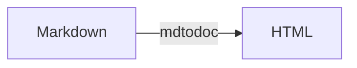

# Markdown To Document

[](https://www.npmjs.com/package/markdown-to-document)
[](https://raw.githubusercontent.com/GaelGirodon/markdown-to-document/master/LICENSE)

[](https://gaelgirodon.visualstudio.com/markdown-to-document)
[](https://gaelgirodon.visualstudio.com/markdown-to-document)
[](https://gaelgirodon.visualstudio.com/markdown-to-document)

A Markdown CLI to easily generate HTML documents from Markdown files.

> The original purpose of this tool was to provide an alternative to using
> Microsoft Word to write and send technical documents.
>
> **Use cases:** replace `docx` and `pdf` files by Markdown (storage in Git,
> editing, ...) and HTML files (export, sending by email, ...), export a
> multi-files documentation into a single HTML file, etc.

## Install

Install the CLI globally using NPM ([Node.js](https://nodejs.org/) >= 12):

```shell
npm i markdown-to-document -g
```

> **Linux users:** `EACCES` permissions errors when installing packages globally?<br>
> → Follow [this guide](https://docs.npmjs.com/resolving-eacces-permissions-errors-when-installing-packages-globally)
> to resolve them.

## Usage

Compile Markdown files (`path`) into HTML documents.

```shell
mdtodoc [options] <path...>
```

Read [usage examples](#examples) to learn how to use the CLI.

### Options

| Option                          | Description                                   |
| ------------------------------- | --------------------------------------------- |
| `-V, --version`                 | Output the version number                     |
| `-d, --dest [value]`            | Destination path (default: next to .md files) |
| `-j, --join`                    | Concatenate all files before compilation      |
| `-l, --layout [value]`          | HTML layout                                   |
| `-t, --theme [value]`           | CSS theme                                     |
| `-s, --highlight-style [value]` | Syntax highlighting style                     |
| `-n, --numbered-headings`       | Enable numbered headings                      |
| `-c, --code-copy`               | Enable copy code button                       |
| `-m, --mermaid`                 | Enable mermaid                                |
| `-e, --embed-mode [value]`      | Embed external resources (default: `default`) |
| `-w, --watch`                   | Watch input files and compile on change       |
| `-h, --help`                    | Output usage information                      |

#### Destination (`--dest`)

The destination path can be used to change where output HTML files are written.

#### Join (`--join`)

> :construction: Experimental feature :construction:

The `--join` option concatenates all Markdown source files in one (`MERGED.md`)
before running the compilation (→ `MERGED.html`) :

- _Sorting_: `README.md` and `index.md` files first, other `.md` files and
  sub-directories next
- _Front matter_: remove YAML (`---`), TOML (`+++`) or JSON (`;;;`) front matter
  from source files
- _Titles_: refactor titles level (`#` syntax only) to reflect path depth
- _Paths_: refactor relative paths (`[<...>](./<...>`) to reflect the directory
  structure
- _Table of contents_: remove table of contents tokens from child pages

This feature, _experimental and not very configurable for the moment_, can be
very useful to export a multi-files documentation into a single HTML file.

#### Layout (`--layout`)

A layout is a HTML template used as a base for the output HTML file, e.g.:

```html
<!DOCTYPE html>
<html lang="en">
<head>
  <!--        ⬐ Markdown document title included here -->
  <title>{{ title }}</title>
  {{ styles }} <!-- ← CSS styles (theme, highlight styles, etc.) included here -->
</head>
<body>
{{ body }}     <!-- ← Compiled Markdown included here -->
</body>
{{ scripts }}  <!-- ← JS scripts included here -->
</html>
```

The `--layout` option can receive the name of a [preset](./assets/layouts/)
(e.g. `page` for `page.html`) or the path to a custom layout file
(`path/to/my-layout.html` or a HTTP URL).

#### Theme (`--theme`)

A theme is a CSS stylesheet included in the HTML layout.

The `--theme` option can receive the name of a [preset](./assets/themes/)
(e.g. `github`) or the path to a custom theme file (`path/to/my-theme.css`
or a HTTP URL).

#### Highlight style (`--highlight-style`)

A highlight style is a CSS stylesheet included in the HTML layout
to add a style to code blocks.

The `--highlight-style` option can receive the name of a
[Hightlight.js style](https://github.com/highlightjs/highlight.js/tree/master/src/styles)
(file name without extension, e.g. `solarized-dark`) or the path to a custom
style file (a local path or a HTTP URL).

#### Additional features

_Markdown To Document_ includes additional features:

- **Numbered headings** (`--numbered-headings`): enable automatic headings
  numbering (`h2` to `h6`, e.g. `1.1.1.`)
- **Code copy** (`--code-copy`): add a button <kbd>Copy</kbd> in each
  code block to easily copy the block content
- **Mermaid** (`--mermaid`): add support for [mermaid](https://mermaid-js.github.io/mermaid/)
  diagrams using fenced code blocks (` ```mermaid `), e.g.:



#### Embed mode (`--embed-mode`)

The `--embed-mode` option allows to inline externally referenced resources
(JS, CSS and images) to output a single HTML file without external dependencies
(it can lead to a large output file).

3 modes are available:

- `light`: inline light scripts (< 16KB), stylesheets and light images
  (< 16KB)
- `default`: inline light scripts (< 16KB), stylesheets and all images
  (**default**)
- `full`: inline everything

### Examples

**Compile a single Markdown file (`doc.md`) into HTML (`doc.html`)**

```shell
mdtodoc doc.md
```

**Watch and compile multiple Markdown files using glob syntax**

```shell
mdtodoc *.md --watch
```

**Compile multiple Markdown files into a single HTML file (`MERGED.html`)**

```shell
mdtodoc *.md --join
```

**Improve the HTML output with a layout, a theme and a highlight style**

```shell
mdtodoc doc.md --layout "page" --theme "github" --highlight-style "atom-one-light"
```

The compiled Markdown is now included into the predefined layout `page`
and some CSS styling is added directly into the HTML file.

**Enable additional extensions**

```shell
mdtodoc doc.md -l "page" -t "github" -s "atom-one-light" --numbered-headings --code-copy --mermaid
```

HTML headings are now automatically numbered, a button <kbd>Copy</kbd>
is added in each code block `<pre>` to copy the content and diagrams
are generated from `mermaid` code blocks (` ```mermaid `).

**Embed all externally referenced resources**

```shell
mdtodoc doc.md -l "page" -t "github" -s "atom-one-light" -n -c --embed-mode "full"
```

All external resources (CSS, JS and images) referenced in the Markdown file
are now embedded into the output HTML file.

**Use a custom layout (local file) and a custom highlight style (URL)**

```shell
mdtodoc doc.md -l "./assets/layouts/page.html" -t "github" -s "https://raw.githubusercontent.com/highlightjs/highlight.js/master/src/styles/monokai.css" -n -c
```

Read [options documentation](#options) for more information on how to use
`--layout`, `--theme` and `--highlight-style` options.

## Resources

### Useful apps, packages & more

#### Code editors

Although Markdown documents are simple text files and can be written using
basic text editors, most code editors provide features and extensions to make
writing these documents easier, e.g.:

- [Markdown All in One](https://marketplace.visualstudio.com/items?itemName=yzhang.markdown-all-in-one)
  (Visual Studio Code)
- [Markdown-Writer](https://atom.io/packages/markdown-writer) (Atom)
- [Markdown​Editing](https://packagecontrol.io/packages/MarkdownEditing) (Sublime Text)

#### Formatting

Markdown files can be easily formatted with [code editors](#code-editors)
using built-in features or additional extensions but code formatters like
[Prettier](https://prettier.io/) also do a good job:

```shell
npm install --global prettier
prettier --check "*.md"
prettier --write "*.md"
```

### Markdown compiler

_Markdown To Document_ uses the [Markdown.it](https://github.com/markdown-it/markdown-it)
compiler and the following plugins to generate HTML code from Markdown:

- `markdown-it-abbr` - Abbreviation (`<abbr>`) tag support
- `markdown-it-anchor` - Header anchors (permalinks) support
- `markdown-it-container` - Custom block containers (`:::`) support
- `markdown-it-deflist` - Definition list (`<dl>`) tag support
- `markdown-it-emoji` - Emoji syntax (`:memo:` → :memo:) support
- `markdown-it-footnote` - Footnotes (`[^1]`) support
- `markdown-it-ins` - Inserted (`<ins>`) tag support
- `markdown-it-mark` - Marked (`<mark>`) tag support
- `markdown-it-sub` - Subscript (`<sub>`) tag support
- `markdown-it-sup` - Superscript (`<sup>`) tag support
- `markdown-it-toc-done-right` - Table of contents (`[[toc]]`) support

Additional features also use the following packages:

- [highlight.js](https://highlightjs.org/) - Javascript syntax highlighter
- [web-resource-inliner](https://github.com/jrit/web-resource-inliner) - Brings
  externally referenced resources, such as js, css and images, into a single file
- [html-minifier](https://github.com/kangax/html-minifier) - Javascript-based
  HTML compressor/minifier
- [clipboard.js](https://clipboardjs.com/) - A modern approach to copy text to clipboard
- [cheerio](https://cheerio.js.org/) - Fast, flexible, and lean implementation
  of core jQuery designed specifically for the server
- [chokidar](https://github.com/paulmillr/chokidar) - A neat wrapper around
  node.js fs.watch / fs.watchFile / FSEvents
- [mermaid](https://mermaid-js.github.io/mermaid/) - Generation of diagram and
  flowchart from text in a similar manner as markdown

Open [package.json](package.json) to see the full list of dependencies.

### Useful links

- [A guide to creating a NodeJS command-line package](https://medium.com/netscape/a-guide-to-create-a-nodejs-command-line-package-c2166ad0452e)
- [Building a Node JS interactive CLI](https://codeburst.io/building-a-node-js-interactive-cli-3cb80ed76c86)
- [Numbered Headings in Markdown via CSS](https://gist.github.com/patik/89ee6092c72a9e39950445c01598517a)

## Development

- Link the `mdtodoc` command for development: `npm link`
  - Unlink: `npm unlink`
- Format code with Prettier: `npm run format[:check]`
- Lint code with ESLint: `npm run lint`
- Build assets with Gulp: `npm run build:assets`
- Run tests: `npm run test[:coverage]`

## License

**Markdown To Document** is licensed under the GNU General Public License.
